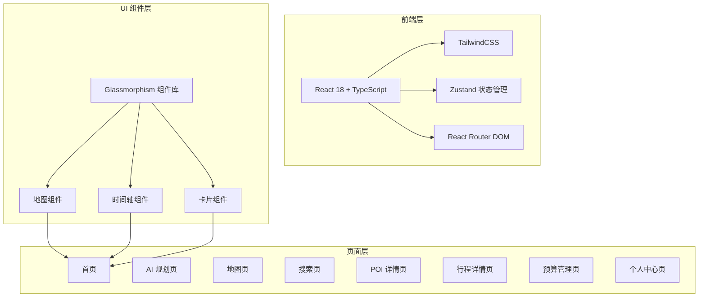

# 途迹 - 技术架构文档

## 1. 架构设计



## 2. 技术选型

- **前端框架**: React 18 + TypeScript
- **构建工具**: Vite
- **样式方案**: TailwindCSS + 自定义 Glassmorphism 样式
- **状态管理**: Zustand
- **路由管理**: React Router DOM v6
- **图标库**: Lucide React
- **地图**: Leaflet + React-Leaflet
- **动画**: CSS Transitions + Framer Motion (可选)

## 3. 路由定义

| 路由 | 页面 | 描述 |
|------|------|------|
| `/` | Home | 首页，热门推荐、快捷入口、我的行程 |
| `/ai-planner` | AI Planner | AI 智能规划页 |
| `/map` | Map | 地图页，景点分布可视化 |
| `/search` | Search | 搜索页 |
| `/poi/:id` | POI Detail | POI 详情页 |
| `/trip/:id` | Trip Detail | 行程详情页 |
| `/budget/:tripId` | Budget | 预算管理页 |
| `/profile` | Profile | 个人中心页 |

## 4. 组件结构

```
src/
├── components/
│   ├── ui/                 # 基础 UI 组件
│   │   ├── GlassCard.tsx      # 玻璃态卡片
│   │   ├── GradientButton.tsx # 渐变按钮
│   │   ├── SearchBar.tsx      # 搜索栏
│   │   └── BottomNav.tsx      # 底部导航
│   ├── layout/
│   │   ├── Header.tsx         # 顶部导航
│   │   └── Sidebar.tsx        # 侧边栏
│   ├── trip/
│   │   ├── TripCard.tsx       # 行程卡片
│   │   ├── Timeline.tsx       # 时间轴
│   │   └── DaySchedule.tsx     # 每日行程
│   ├── poi/
│   │   ├── POICard.tsx        # POI 卡片
│   │   └── POIGallery.tsx     # 图片轮播
│   └── budget/
│       ├── BudgetProgress.tsx # 预算进度
│       └── ExpenseList.tsx     # 花费列表
├── pages/
│   ├── Home.tsx
│   ├── AIPlanner.tsx
│   ├── Map.tsx
│   ├── Search.tsx
│   ├── POIDetail.tsx
│   ├── TripDetail.tsx
│   ├── Budget.tsx
│   └── Profile.tsx
├── store/
│   ├── useTripStore.ts     # 行程状态
│   ├── usePOIStore.ts      # POI 状态
│   └── useBudgetStore.ts  # 预算状态
├── data/
│   └── mock.ts             # 模拟数据
└── styles/
    └── glass.css           # 玻璃态样式
```

## 5. 设计系统

### 5.1 颜色变量

```css
:root {
  /* 主色调 - 靛蓝 → 紫色 → 粉色渐变 */
  --color-primary-start: #6366f1;   /* indigo-500 */
  --color-primary-mid: #8b5cf6;     /* purple-500 */
  --color-primary-end: #ec4899;     /* pink-500 */

  /* 背景色 */
  --color-bg-start: #f8fafc;        /* slate-50 */
  --color-bg-mid: rgba(99, 102, 241, 0.1);  /* indigo-50/30 */
  --color-bg-end: rgba(236, 72, 153, 0.1);  /* pink-50/20 */

  /* 玻璃态 */
  --glass-bg: rgba(255, 255, 255, 0.1);
  --glass-border: rgba(255, 255, 255, 0.2);
  --glass-shadow: 0 8px 32px 0 rgba(31, 38, 135, 0.37);

  /* 功能色 */
  --color-success: #10b981;        /* emerald-500 */
  --color-warning: #f59e0b;        /* amber-500 */
  --color-favorite: #f43f5e;      /* rose-500 */
  --color-info: #3b82f6;           /* blue-500 */
}
```

### 5.2 字体

- **标题**: "Noto Sans SC", "PingFang SC", sans-serif; font-weight: 700
- **正文**: "Noto Sans SC", "PingFang SC", sans-serif; font-weight: 400
- **数字**: "SF Pro Display", "Roboto", monospace

### 5.3 断点

- 移动端: max-width: 768px
- 平板: 769px - 1024px
- 桌面: min-width: 1025px

## 6. 页面设计

### 6.1 首页
- Hero 区域：渐变背景、大标题、玻璃态新建行程按钮
- 热门推荐：横向滚动卡片、玻璃态背景
- 我的行程：玻璃态卡片列表

### 6.2 AI 智能规划页
- 行程信息输入表单（玻璃态）
- 偏好设置标签选择器
- 行程时间轴（垂直时间轴 + 景点卡片）

### 6.3 地图页
- 全屏地图（Leaflet）
- 景点标记点
- 底部弹出信息卡

### 6.4 搜索页
- 玻璃态搜索框
- 筛选排序栏
- 瀑布流卡片布局

### 6.5 POI 详情页
- 图片轮播
- 基本信息玻璃态卡片
- 操作按钮（添加行程、收藏）

### 6.6 行程详情页
- 行程概览
- 每日时间轴
- 景点管理

### 6.7 预算管理页
- 环形进度图
- 分类预算进度条
- 花费记录列表

### 6.8 个人中心页
- 头像和信息编辑
- 我的收藏、行程、足迹入口
- 设置列表

## 7. 动画效果

- Ripple 水波纹动画（按钮点击）
- Float 浮动动画（悬浮元素）
- 玻璃态背景模糊（backdrop-filter）
- 卡片悬浮效果（hover:scale, hover:shadow）
- 页面切换过渡动画
