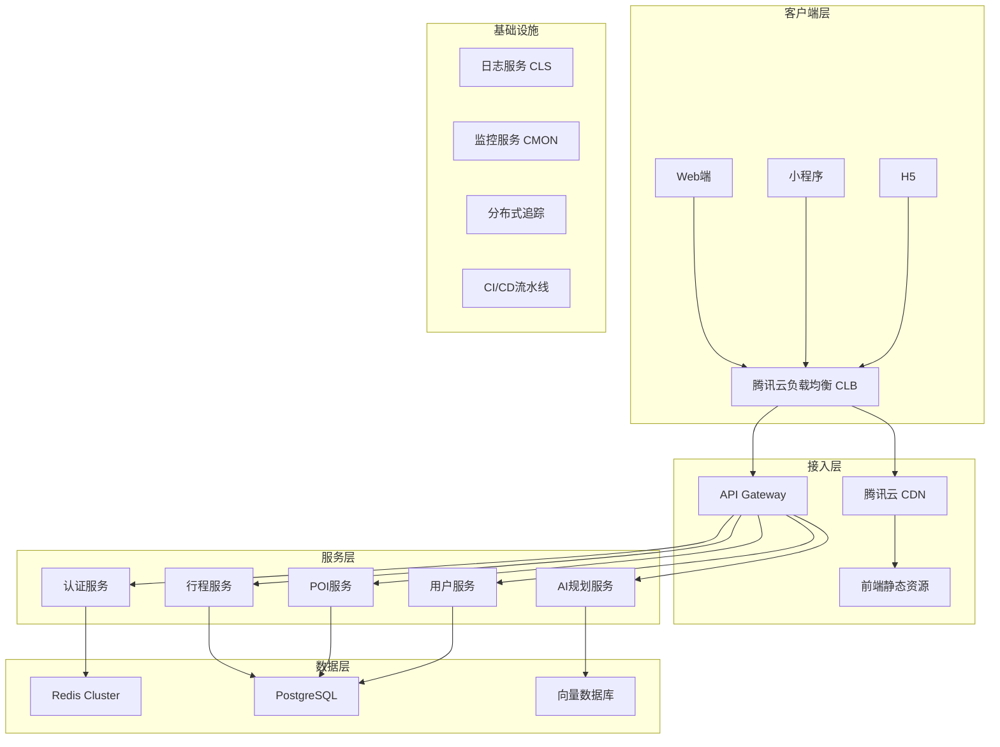

# 途迹 - 生产部署架构方案

## 1. 需求分析

| 指标 | 值 | 说明 |
|------|-----|------|
| 目标用户规模 | 1000万 | DAU 预估 50-100万 |
| QPS 峰值 | 10000+ | 需要水平扩展能力 |
| 数据规模 | 10亿+ POI记录 | 需要分区/分片 |
| 部署平台 | 腾讯云 | 全栈云服务 |
| 团队规模 | 10人 | 需要自动化运维 |
| 合规要求 | 暂无 | 但需预留扩展能力 |

## 2. 整体架构



## 3. 网络架构

### 3.1 VPC 规划

| 区域 | 配置 | 说明 |
|------|------|------|
| 主Region | 广州(ap-guangzhou) | 核心业务部署 |
| 备Region | 上海(ap-shanghai) | 容灾备份 |
| VPC CIDR | 10.0.0.0/16 | 主VPC |
| 子网划分 | 3个可用区各1个子网 | 高可用部署 |

### 3.2 安全组策略

| 安全组 | 规则 | 说明 |
|--------|------|------|
| 前端安全组 | 允许80/443入站 | CDN回源 |
| 后端安全组 | 允许CLB入站 | API访问 |
| 数据库安全组 | 仅允许后端安全组入站 | 隔离保护 |
| Redis安全组 | 仅允许后端安全组入站 | 隔离保护 |

## 4. 服务部署架构

### 4.1 后端服务

| 服务 | 实例规格 | 最小实例数 | 最大实例数 | 说明 |
|------|----------|------------|------------|------|
| 认证服务 | CVM 8核16G | 2 | 10 | JWT认证、短信验证码 |
| 行程服务 | CVM 8核16G | 3 | 15 | 行程CRUD、POI关联 |
| POI服务 | CVM 8核16G | 2 | 8 | POI搜索、推荐 |
| 用户服务 | CVM 4核8G | 2 | 6 | 用户信息、收藏 |
| AI规划服务 | CVM 16核32G | 2 | 10 | AI模型调用 |

### 4.2 负载均衡

- **CLB 类型**: 应用型负载均衡
- **协议**: HTTPS (TLS 1.3)
- **会话保持**: 基于Cookie
- **健康检查**: HTTP 200 /health
- **自动扩缩容**: 基于QPS/CPU/内存

### 4.3 前端部署

| 组件 | 配置 | 说明 |
|------|------|------|
| CDN | 腾讯云CDN | 全球加速、HTTPS |
| 静态资源 | 对象存储COS | 图片、JS/CSS |
| 缓存策略 | 静态文件1年、API 5分钟 | 缓存优化 |

## 5. 数据库架构

### 5.1 PostgreSQL

| 配置项 | 值 | 说明 |
|--------|-----|------|
| 实例类型 | 云数据库 PostgreSQL | 高可用版 |
| 规格 | 16核64G | 主库 |
| 只读副本 | 2-4个 | 读写分离 |
| 存储 | 云硬盘 | 按需扩展 |
| 自动备份 | 每日备份 | 保留30天 |
| 连接池 | PgBouncer | 连接管理 |

**数据库分区策略：**

```sql
-- trips 表按日期分区
CREATE TABLE trips (
    id UUID PRIMARY KEY,
    user_id UUID NOT NULL,
    name TEXT NOT NULL,
    destination TEXT NOT NULL,
    start_date DATE NOT NULL,
    ...
) PARTITION BY RANGE (start_date);

-- trip_pois 表按 trip_id hash分区
CREATE TABLE trip_pois (
    id UUID PRIMARY KEY,
    trip_id UUID NOT NULL,
    ...
) PARTITION BY HASH (trip_id);
```

### 5.2 Redis

| 配置项 | 值 | 说明 |
|--------|-----|------|
| 实例类型 | Redis Cluster | 集群版 |
| 节点数 | 3主3从 | 高可用 |
| 规格 | 每个节点16G | 内存容量 |
| 密码保护 | 启用 | 安全 |
| 连接数限制 | 10000+ | 高并发 |

**Redis 用途：**

| 用途 | Key设计 | TTL |
|------|---------|-----|
| JWT Token | `jwt:{user_id}` | 7天 |
| 用户会话 | `session:{user_id}` | 2小时 |
| POI热门缓存 | `poi:hot:{city}` | 1小时 |
| 行程缓存 | `trip:{trip_id}` | 10分钟 |
| 限流 | `rate_limit:{ip}` | 1分钟 |

### 5.3 向量数据库（AI规划用）

| 配置项 | 值 | 说明 |
|--------|-----|------|
| 服务 | 腾讯云向量数据库 | 托管服务 |
| 用途 | POI语义搜索、推荐 | AI功能支撑 |

## 6. 消息队列

| 配置项 | 值 | 说明 |
|--------|-----|------|
| 服务 | 腾讯云 CMQ | 消息队列 |
| 用途 | 异步任务、解耦 | 行程创建、通知 |

**队列设计：**

| 队列名 | 用途 | 延迟要求 |
|--------|------|----------|
| trip_create | 行程创建完成通知 | 实时 |
| poi_recommend | POI推荐计算 | 秒级 |
| data_sync | 数据同步到搜索索引 | 分钟级 |
| log_analysis | 日志分析 | 异步 |

## 7. CI/CD 流水线

### 7.1 代码仓库

- **代码托管**: 腾讯云代码仓库或 GitHub
- **分支策略**: Git Flow

### 7.2 构建流程

```
代码提交 → 代码审查 → CI构建 → 单元测试 → 安全扫描 → 镜像构建 → 部署
```

### 7.3 部署策略

- **蓝绿部署**: 后端服务
- **滚动更新**: 前端静态资源
- **灰度发布**: 新功能上线

### 7.4 工具链

| 工具 | 用途 |
|------|------|
| Jenkins/GitLab CI | 流水线编排 |
| Docker | 容器化 |
| TKE | 容器集群 |
| Harbor | 镜像仓库 |

## 8. 监控告警

### 8.1 监控指标

| 监控项 | 阈值 | 告警级别 |
|--------|------|----------|
| CPU使用率 | >80% | 警告 |
| 内存使用率 | >85% | 警告 |
| 磁盘使用率 | >90% | 严重 |
| 响应时间 | >500ms | 警告 |
| 错误率 | >5% | 严重 |
| 数据库连接数 | >80% | 警告 |
| Redis内存 | >85% | 警告 |

### 8.2 日志管理

| 组件 | 用途 |
|------|------|
| 腾讯云CLS | 日志收集、存储、检索 |
| ELK | 日志分析、可视化 |
| 告警规则 | 关键字匹配、错误率统计 |

### 8.3 链路追踪

| 组件 | 用途 |
|------|------|
| OpenTelemetry | 分布式追踪 |
| Jaeger | 追踪数据存储、查询 |

## 9. 运维管理

### 9.1 自动化运维

| 场景 | 方案 |
|------|------|
| 自动扩缩容 | TKE HPA + CA |
| 故障自愈 | 健康检查 + 自动重启 |
| 备份恢复 | 自动备份 + 手动恢复 |
| 安全补丁 | 定期更新 + 灰度发布 |

### 9.2 成本优化

| 策略 | 说明 |
|------|------|
| 按需计费 | 开发/测试环境 |
| 预留实例 | 生产环境核心服务 |
| 自动关机 | 非工作时间关闭测试环境 |
| 资源回收 | 定期清理无用资源 |

## 10. 安全方案

### 10.1 网络安全

| 措施 | 说明 |
|------|------|
| DDoS防护 | 腾讯云DDoS防护 |
| WAF | Web应用防火墙 |
| SSL证书 | HTTPS全站加密 |
| 安全组 | 最小权限原则 |

### 10.2 数据安全

| 措施 | 说明 |
|------|------|
| 数据加密 | 传输加密 + 存储加密 |
| 访问控制 | IAM角色 + 权限管理 |
| 审计日志 | 操作记录 + 合规审计 |
| 脱敏处理 | 敏感数据脱敏 |

## 11. 容量规划

### 11.1 当前容量

| 资源 | 当前配置 | 支撑用户 |
|------|----------|----------|
| 数据库 | 16核64G | 100万 |
| Redis | 3主3从 | 500万 |
| 后端实例 | 8核16G × 10 | 100万DAU |

### 11.2 扩容路径

| 用户规模 | 数据库规格 | Redis节点 | 后端实例数 |
|----------|------------|-----------|------------|
| 100万 | 16核64G | 3主3从 | 10 |
| 500万 | 32核128G | 6主6从 | 30 |
| 1000万 | 分库分表 | 12主12从 | 50 |

## 12. 容灾方案

### 12.1 同城容灾

| 方案 | 说明 | RTO | RPO |
|------|------|-----|-----|
| 主从切换 | PostgreSQL主从切换 | <30秒 | 0 |
| 实例故障转移 | TKE自动重启 | <1分钟 | 0 |

### 12.2 跨城容灾

| 方案 | 说明 | RTO | RPO |
|------|------|-----|-----|
| 异步复制 | 跨Region数据同步 | <1小时 | <5分钟 |
| DNS切换 | 手动切换到备Region | <30分钟 | <5分钟 |

## 13. 部署清单

### 13.1 腾讯云服务清单

| 服务 | 数量 | 预估费用(月) |
|------|------|--------------|
| CVM | 10-20台 | ¥20,000-40,000 |
| CLB | 1个 | ¥500 |
| PostgreSQL | 1主2从 | ¥8,000 |
| Redis | 3主3从 | ¥5,000 |
| CDN | 1个 | ¥2,000 |
| COS | 按需 | ¥1,000 |
| CMQ | 按需 | ¥500 |
| 监控告警 | 1个 | ¥500 |
| **总计** | | **¥37,500-57,500** |

### 13.2 环境配置文件

```env
# 生产环境 .env.production
NODE_ENV=production
PORT=3000

# 数据库配置
DB_TYPE=postgres
DB_HOST=tuji-postgres.cluster-cn-guangzhou.tencentcs.com
DB_PORT=5432
DB_USERNAME=tuji_prod
DB_PASSWORD=${DB_PASSWORD_SECRET}
DB_DATABASE=tuji_prod

# Redis配置
REDIS_HOST=tuji-redis.cluster-cn-guangzhou.tencentcs.com
REDIS_PORT=6379
REDIS_PASSWORD=${REDIS_PASSWORD_SECRET}

# JWT配置
JWT_SECRET=${JWT_SECRET_SECRET}
JWT_EXPIRES_IN=7d

# 腾讯云配置
TENCENT_CLOUD_SECRET_ID=${TENCENT_CLOUD_SECRET_ID}
TENCENT_CLOUD_SECRET_KEY=${TENCENT_CLOUD_SECRET_KEY}
```

## 14. 团队分工建议（10人）

| 角色 | 人数 | 职责 |
|------|------|------|
| 后端开发 | 3人 | 服务开发、API设计 |
| 前端开发 | 3人 | Web/小程序/H5开发 |
| AI算法 | 1人 | 推荐算法、AI规划 |
| DevOps | 1人 | 运维、CI/CD、监控 |
| 测试 | 1人 | 自动化测试、质量保障 |
| 架构师 | 1人 | 技术决策、架构演进 |

## 15. 实施步骤

| 阶段 | 时间 | 目标 |
|------|------|------|
| 第一阶段 | 1-2周 | 基础设施搭建、网络配置 |
| 第二阶段 | 2-3周 | 数据库迁移、Redis部署 |
| 第三阶段 | 2-3周 | 后端服务容器化、CI/CD |
| 第四阶段 | 1-2周 | 前端部署、CDN配置 |
| 第五阶段 | 1-2周 | 监控告警、安全加固 |
| 第六阶段 | 持续 | 性能优化、容量规划 |

## 16. 关键风险点

| 风险 | 影响 | 缓解措施 |
|------|------|----------|
| 数据库性能瓶颈 | 查询慢、写入延迟 | 读写分离、索引优化、分库分表 |
| API响应慢 | 用户体验差 | 缓存策略、异步处理、负载均衡 |
| DDoS攻击 | 服务不可用 | DDoS防护、WAF、限流 |
| 数据丢失 | 业务中断 | 自动备份、多副本、跨区域同步 |
| 团队规模小 | 迭代慢 | 自动化工具、标准化流程 |