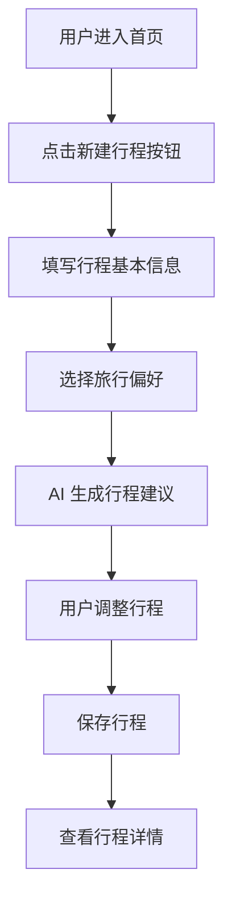
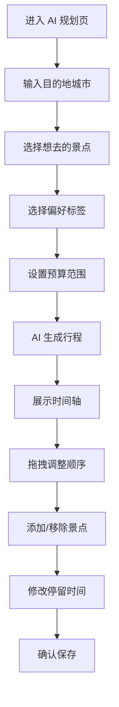
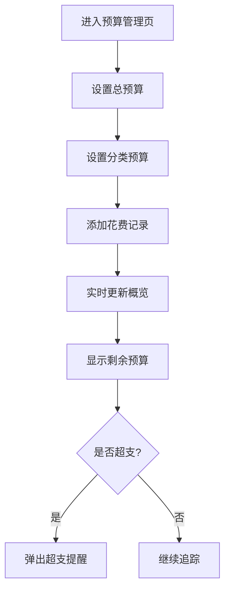
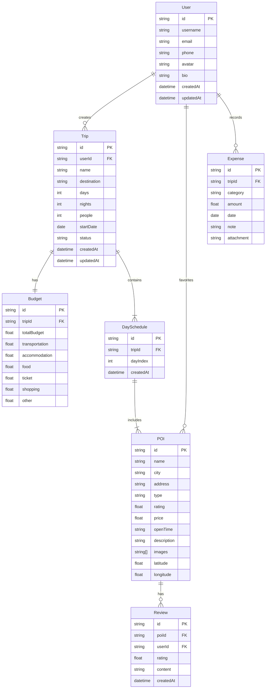

# 途迹 - 智能旅行规划 APP 产品需求文档

## 1. 产品概述

途迹是一款基于 AI 的智能旅行规划应用,帮助用户快速生成个性化行程、管理旅行预算、记录旅行足迹。产品价值包括效率提升(AI 一键生成行程)、智能推荐(基于偏好的个性化景点推荐)、预算可控(分类预算管理,实时追踪花费)以及美好回忆(旅行足迹记录和分享)。

**目标用户**:
- 热爱旅行的年轻人
- 需要高效规划行程的商务人士
- 喜欢分享旅行体验的内容创作者

## 2. 核心功能

### 2.1 用户角色

| 角色 | 注册方式 | 核心权限 |
|------|---------|---------|
| 游客 | 无需注册 | 浏览景点、创建行程(本地存储)、查看地图 |
| 注册用户 | 邮箱/手机号注册 | 所有游客权限 + 云端同步、社区互动、行程分享 |

### 2.2 功能模块

#### 2.2.1 核心页面

1. **首页**: 热门推荐、快捷入口、我的行程
2. **AI 智能规划页**: 智能行程生成、个性化设置、行程调整
3. **地图页**: 景点分布可视化、路线规划、周边推荐
4. **搜索页**: 关键词搜索、筛选排序、搜索历史
5. **POI 详情页**: 景点信息、收藏功能、添加到行程
6. **行程详情页**: 时间轴展示、景点管理、预算统计
7. **预算管理页**: 预算设置、花费追踪、预算概览
8. **个人中心页**: 个人信息、我的收藏、我的足迹、设置

#### 2.2.2 特色功能

- **AI 智能规划**: 一键生成行程,支持早中晚三餐规划,自动安排每日时间线
- **玻璃态设计**: Glassmorphism 设计语言,背景模糊,半透明效果
- **多端适配**: 移动端(PWA)、桌面端(Web)、桌面应用(Electron)
- **数据安全**: AES 加密、请求签名、XSS 防护、路由守卫

### 2.3 页面详情

| 页面名称 | 模块名称 | 功能描述 |
|---------|---------|---------|
| 首页 | Hero 区域 | 品牌展示、新建行程快捷入口、AI 规划入口 |
| 首页 | 热门推荐 | 热门城市、热门景点卡片横向滚动展示 |
| 首页 | 我的行程 | 最近行程列表,支持快速查看和编辑 |
| AI 智能规划页 | 行程信息输入 | 目的地城市、天数、人数、出发日期输入 |
| AI 智能规划页 | 偏好设置 | 旅行偏好标签选择、预算范围设定 |
| AI 智能规划页 | 行程生成 | AI 一键生成行程,支持手动调整 |
| AI 智能规划页 | 行程时间轴 | 拖拽排序、上移下移按钮、时间标签显示 |
| 地图页 | 地图展示 | 景点分布标记、点击查看详情 |
| 地图页 | 路线规划 | 基础路线规划、距离显示 |
| 地图页 | 周边推荐 | 当前位置周边景点推荐 |
| 搜索页 | 搜索输入 | 关键词搜索、搜索历史记录 |
| 搜索页 | 筛选排序 | 按城市、类型筛选,按评分排序 |
| 搜索页 | 搜索结果 | 景点、美食、酒店列表展示 |
| POI 详情页 | 基本信息 | 图片轮播、名称、评分、地址、开放时间、票价 |
| POI 详情页 | 详细介绍 | 景点简介、用户评价 |
| POI 详情页 | 操作功能 | 添加到行程、收藏、相关推荐 |
| 行程详情页 | 行程概览 | 行程名称、天数、人数、总预算 |
| 行程详情页 | 时间轴 | 每日行程展示、景点卡片、时间标签 |
| 行程详情页 | 行程编辑 | 编辑基本信息、添加删除天数、复制行程 |
| 预算管理页 | 预算设置 | 总预算、分类预算(交通、住宿、餐饮、门票、购物、其他) |
| 预算管理页 | 花费追踪 | 添加花费记录、按分类/日期统计 |
| 预算管理页 | 预算概览 | 总预算 vs 已花费、剩余预算、超支提醒 |
| 个人中心页 | 个人信息 | 头像、昵称、简介编辑 |
| 个人中心页 | 我的数据 | 我的收藏、我的行程、我的足迹 |
| 个人中心页 | 设置 | 主题切换、通知设置、隐私设置 |

## 3. 核心流程

### 3.1 新建行程流程

用户进入首页,点击新建行程按钮,填写行程基本信息(名称、目的地、天数、人数、出发日期),选择旅行偏好,AI 自动生成行程建议,用户可以手动调整行程顺序,保存行程。

### 3.2 AI 智能规划流程

用户进入 AI 规划页,输入目的地城市,选择想去的景点(可多选),选择偏好标签(自然风光、历史文化、美食探店等),设置预算范围,AI 基于规则引擎生成行程,展示每日时间轴,用户可拖拽调整景点顺序,添加/移除景点,修改停留时间,确认保存。

### 3.3 预算管理流程

用户进入预算管理页,设置总预算和分类预算,在行程中添加花费记录,系统实时更新预算概览,显示剩余预算,当某分类超支时弹出提醒。

## 4. 用户界面设计

### 4.1 设计风格

**玻璃态设计 (Glassmorphism)**:
- `backdrop-filter: blur()` 背景模糊效果
- 半透明背景 (`rgba(255, 255, 255, 0.1)`)
- 细边框 (`border: 1px solid rgba(255, 255, 255, 0.2)`)
- 柔和阴影 (`box-shadow: 0 8px 32px 0 rgba(31, 38, 135, 0.37)`)

**配色方案**:
- 主色调: 靛蓝色(indigo) → 紫色(purple) → 粉色(pink) 渐变
- 背景色: 浅灰渐变 (`slate-50 → indigo-50/30 → purple-50/20`)
- 文字色: 深灰(`gray-800`)、中灰(`gray-600`)、浅灰(`gray-400`)
- 功能色:
  - 成功: 翠绿色(`emerald/teal`)
  - 警告: 琥珀色(`amber/orange`)
  - 喜欢: 玫红色(`rose/pink`)
  - 信息: 蓝色(`blue/indigo`)

**字体排版**:
- 标题: 粗体、大号字体
- 正文: 常规、中等大小
- 辅助文字: 小号、浅色
- 数字: 等宽字体感

**按钮样式**:
- 圆角设计 (`rounded-lg`, `rounded-xl`)
- 悬浮阴影效果
- 渐变背景
- Ripple 水波纹动画

**动画效果**:
- Ripple 水波纹
- Glow 发光
- Float 浮动
- 玻璃态背景模糊
- 卡片悬浮效果
- 图片 hover 放大

### 4.2 页面设计概览

| 页面名称 | 模块名称 | UI 元素 |
|---------|---------|---------|
| 首页 | Hero 区域 | 渐变背景、大标题、玻璃态卡片、新建行程按钮带长按语音动效 |
| 首页 | 热门推荐 | 横向滚动卡片、玻璃态背景、图片 hover 放大、城市/景点标签 |
| 首页 | 我的行程 | 玻璃态卡片、时间轴展示、行程状态标签、快捷操作按钮 |
| AI 智能规划页 | 行程信息输入 | 玻璃态表单、输入框、日期选择器、人数输入、天夜数输入(固定文字) |
| AI 智能规划页 | 偏好设置 | 标签选择器(多选)、预算滑块、玻璃态卡片 |
| AI 智能规划页 | 行程时间轴 | 垂直时间轴、景点卡片(图片+名称+评分+简介)、拖拽排序、上移下移按钮、类型标签(景点/餐饮/交通/住宿) |
| 地图页 | 地图展示 | 全屏地图、景点标记点、点击弹出信息卡、当前位置标记 |
| 地图页 | 路线规划 | 路线显示、距离/时间预估、路线切换按钮 |
| 搜索页 | 搜索输入 | 玻璃态搜索框、搜索图标、清空按钮、搜索历史下拉 |
| 搜索页 | 筛选排序 | 玻璃态筛选标签、下拉选择器、排序切换按钮 |
| 搜索页 | 搜索结果 | 瀑布流卡片布局、图片+名称+评分+地址、点击跳转详情 |
| POI 详情页 | 基本信息 | 图片轮播、名称、评分星级、地址、开放时间、票价、地图定位按钮 |
| POI 详情页 | 详细介绍 | 玻璃态内容区、景点简介、用户评价卡片、相关推荐卡片 |
| POI 详情页 | 操作功能 | 固定底部按钮(添加到行程、收藏)、悬浮动画 |
| 行程详情页 | 行程概览 | 玻璃态卡片、行程名称、天数、人数、总预算统计 |
| 行程详情页 | 时间轴 | 垂直时间轴、每日分组、景点卡片、时间标签、类型标签、操作按钮 |
| 预算管理页 | 预算设置 | 玻璃态表单、输入框、分类预算网格、进度条 |
| 预算管理页 | 花费追踪 | 添加花费按钮、花费列表(金额+分类+日期+备注)、分类统计图表 |
| 预算管理页 | 预算概览 | 环形进度图、剩余预算数字、各分类进度条、超支警告卡片 |
| 个人中心页 | 个人信息 | 头像上传、昵称编辑、简介输入、玻璃态卡片 |
| 个人中心页 | 我的数据 | 玻璃态卡片列表、图标+文字、点击跳转 |
| 个人中心页 | 设置 | 开关切换、下拉选择、玻璃态列表项 |

### 4.3 响应式设计

**移动端优先(PWA)**:
- 底部导航栏(首页、AI规划、+、地图、我的)
- 单列布局
- 横向滚动卡片
- 触摸友好的交互(大按钮、滑动手势)
- 字体自适应缩放

**桌面端(Web/桌面应用)**:
- 顶部导航栏
- 左侧固定边栏(快捷入口、热门城市)
- Hero 大标题区域
- 多列网格布局
- 鼠标悬停效果(卡片阴影、图片放大)
- 更大的卡片和图片尺寸

**断点设计**:
- 移动端: `max-width: 768px`
- 平板: `min-width: 769px` and `max-width: 1024px`
- 桌面: `min-width: 1025px`

### 4.4 交互设计细节

**导航栏交互**:
- 新建行程按钮:
  - 点击: 进入新建行程页面
  - 长按: 语音输入模式,显示絮状物往上不规则飘动动效(朦胧感)
  - 松手后录制完成,跳转到 AI 智能规划页面并填充文本

**新建行程表单**:
- 旅游天数: 填写式(非选择式)
- 格式: `x天x夜`(固定"天"和"夜"字,数字为输入项)
- 逻辑验证: 夜数不能大于天数

**行程时间轴**:
- 支持拖拽排序景点顺序
- 支持上移/下移按钮调整
- 显示时间标签(如: 09:00-11:00)
- 显示类型标签(景点、餐饮、交通、住宿)

## 5. 数据模型

### 5.1 核心实体

## 6. 非功能需求

### 6.1 性能要求
- 首页加载时间 < 2秒
- 地图渲染流畅,帧率 > 30fps
- 拖拽排序响应时间 < 100ms
- 支持离线访问(PWA Service Worker)

### 6.2 安全要求
- 数据传输 HTTPS 加密
- 敏感数据 AES 加密存储
- 密码使用 MD5/SHA256 哈希
- XSS 防护、CSRF Token
- 请求签名机制、时间戳防重放

### 6.3 兼容性要求
- 支持 Chrome、Firefox、Safari、Edge 最新版本
- 支持 iOS Safari、Android Chrome
- 支持 Windows、macOS、Linux 桌面应用

### 6.4 可用性要求
- 游客模式无需登录即可使用核心功能
- 本地存储数据支持云端同步
- 清晰的错误提示和引导
- 支持键盘导航和无障碍访问